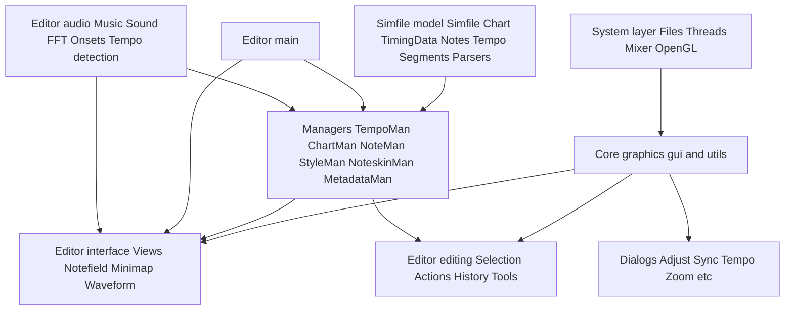

# ArrowVortex Architecture Overview

Audience and scope

This document describes ArrowVortex at a 10000 ft view, using StepMania 5 terminology where analogous, to help SM maintainers orient quickly. It references concrete types and files in this repository. For a deeper mapping see [stepmania-mapping.md](./stepmania-mapping.md).

Entry points and project layout

The Visual Studio solution groups code into logical areas that match the subsystems below: [ArrowVortex.sln](../../build/VisualStudio/ArrowVortex.sln) and [ArrowVortex.vcxproj.filters](../../build/VisualStudio/ArrowVortex.vcxproj.filters).

Subsystems at a glance

Core
- Responsibilities: fundamental types, containers, utilities; rendering and text; immediate mode-ish GUI toolkit.
- Key base types: [Vortex::String](../../src/Core/String.h), [Vortex::Vector](../../src/Core/Vector.h), [Vortex::ByteStream](../../src/Core/ByteStream.h), [Vortex::NonCopyable](../../src/Core/NonCopyable.h)
- Graphics: [Renderer](../../src/Core/Renderer.h), [Texture](../../src/Core/Texture.h), [ImageLoader](../../src/Core/ImageLoader.h), [TextLayout](../../src/Core/TextLayout.h), FreeType integration.
- GUI: [GuiContext](../../src/Core/GuiContext.h), [GuiManager](../../src/Core/GuiManager.h), [GuiWidget](../../src/Core/GuiWidget.h), widgets in [Widgets*.h](../../src/Core/Widgets.h)

System
- Responsibilities: OS integration, files, threads, audio mixer, OpenGL bootstrap.
- Key types: [System](../../src/System/System.h), [File](../../src/System/File.h), [Thread](../../src/System/Thread.h), [Mixer](../../src/System/Mixer.h), [OpenGL](../../src/System/OpenGL.h), [Debug](../../src/System/Debug.h)

Simfile Data Model and I/O
- Responsibilities: in-memory representation of a simfile and charts; timing model; serialization for SM, DWI, osu; validation.
- Key types: [Vortex::Simfile](../../src/Simfile/Simfile.h), [Vortex::Chart](../../src/Simfile/Chart.h#L12), [Vortex::TimingData](../../src/Simfile/TimingData.h#L10), [Vortex::Tempo](../../src/Simfile/Tempo.h), [Vortex::NoteList](../../src/Simfile/NoteList.h), [Vortex::Notes](../../src/Simfile/Notes.h), [Vortex::ExpandedNote](../../src/Simfile/Notes.h#L22)
- Timing helpers: [Vortex::TempoTimeTracker](../../src/Simfile/TimingData.h#L48), [Vortex::TempoRowTracker](../../src/Simfile/TimingData.h#L66)
- Formats: loaders [LoadSm.cpp](../../src/Simfile/LoadSm.cpp), [LoadDwi.cpp](../../src/Simfile/LoadDwi.cpp), [LoadOsu.cpp](../../src/Simfile/LoadOsu.cpp); savers [SaveSm.cpp](../../src/Simfile/SaveSm.cpp), [SaveOsu.cpp](../../src/Simfile/SaveOsu.cpp); parsing utilities [Parsing.h](../../src/Simfile/Parsing.h)

Managers
- Responsibilities: stateful controllers for the active simfile, chart, notes, tempo, styles, noteskins, metadata.
- Key types: [Vortex::TempoMan](../../src/Managers/TempoMan.h#L8), [ChartMan](../../src/Managers/ChartMan.h), [NoteMan](../../src/Managers/NoteMan.h), [SimfileMan](../../src/Managers/SimfileMan.h), [StyleMan](../../src/Managers/StyleMan.h), [NoteskinMan](../../src/Managers/NoteskinMan.h), [MetadataMan](../../src/Managers/MetadataMan.h)
- SM5 analogs: TempoMan aligns with parts of StepMania TimingData editing logic; StyleMan and NoteskinMan align with StepsType and NoteSkinManager responsibilities.

Editor Interface
- Responsibilities: main view composition and UI surfaces for editing: notefield, minimap, waveform, tempo boxes, overlays, menus, status bar.
- Key types: [Vortex::Editor](../../src/Editor/Editor.h#L7), [View](../../src/Editor/View.h), [Notefield](../../src/Editor/Notefield.h), [Minimap](../../src/Editor/Minimap.h), [Waveform](../../src/Editor/Waveform.h), [TempoBoxes](../../src/Editor/TempoBoxes.h), [Menubar](../../src/Editor/Menubar.h), [Statusbar](../../src/Editor/Statusbar.h), [TextOverlay](../../src/Editor/TextOverlay.h)
- SM5 analogs: Notefield corresponds to StepMania NoteField; menus/status similar to ScreenEdit components.

Editor Editing
- Responsibilities: selection model, actions, history, shortcuts, cross-chart tools like stream generator and rating estimator; sanitization.
- Key types: [Editing](../../src/Editor/Editing.h), [Selection](../../src/Editor/Selection.h), [Action](../../src/Editor/Action.h), [History](../../src/Editor/History.h), [Shortcuts](../../src/Editor/Shortcuts.h), [StreamGenerator](../../src/Editor/StreamGenerator.h), [RatingEstimator](../../src/Editor/RatingEstimator.h)

Editor Audio and Analysis
- Responsibilities: playback and synchronization, waveform, onset and tempo detection, audio format loading, Ogg conversion, filtering.
- Key types: [Music](../../src/Editor/Music.h), [Sound](../../src/Editor/Sound.h), [FFT](../../src/Editor/FFT.cpp), [Butterworth](../../src/Editor/Butterworth.h), [FindOnsets](../../src/Editor/FindOnsets.h), [FindTempo](../../src/Editor/FindTempo.h), [LoadMp3](../../src/Editor/LoadMp3.cpp), [LoadOgg](../../src/Editor/LoadOgg.cpp), [LoadWav](../../src/Editor/LoadWav.cpp), [ConvertToOgg](../../src/Editor/ConvertToOgg.h), [Aubio](../../src/Editor/Aubio.h)
- Third party: libmad, libogg/libvorbis, FreeType.

Dialogs
- Responsibilities: feature-specific panels and workflows: adjust sync, adjust tempo, zoom, custom snaps, chart/song properties, waveform settings, dancing bot, generate notes, etc.
- Examples: [AdjustSync](../../src/Dialogs/AdjustSync.h), [AdjustTempo](../../src/Dialogs/AdjustTempo.h), [AdjustTempoSM5](../../src/Dialogs/AdjustTempoSM5.h), [Zoom](../../src/Dialogs/Zoom.h), [CustomSnap](../../src/Dialogs/CustomSnap.h), [ChartProperties](../../src/Dialogs/ChartProperties.h), [SongProperties](../../src/Dialogs/SongProperties.h), [WaveformSettings](../../src/Dialogs/WaveformSettings.h), [DancingBot](../../src/Dialogs/DancingBot.h), [GenerateNotes](../../src/Dialogs/GenerateNotes.h), [ChartList](../../src/Dialogs/ChartList.h), [NewChart](../../src/Dialogs/NewChart.h), [TempoBreakdown](../../src/Dialogs/TempoBreakdown.h)

High-level data flow and responsibilities

- Simfile and Chart hold the authoritative data model, managed by Managers.
- Editor Interface renders the model via Core Graphics and GUI, and routes user input to Editor Editing and Managers.
- Audio subsystem synchronizes playback and visualization and informs tools like visual sync and onset detection.
- System abstracts OS, file I/O, threads, and audio mixing; Core Graphics/GUI provides rendering primitives.

Mermaid diagram

StepMania 5 terminology mapping summary

- Simfile ~ Song
- Chart ~ Steps
- Style ~ StepsType game style
- Notes and NoteList ~ NoteData and TapNote/TapNoteType
- TimingData and Tempo segments ~ TimingData BPMS STOPS WARPS TIME_SIGNATURES
- Notefield ~ NoteField
- Noteskin and Style managers ~ NoteSkinManager and StepsType handling

Anchors into source code

- [Vortex::TimingData](../../src/Simfile/TimingData.h#L10), [Vortex::TempoTimeTracker](../../src/Simfile/TimingData.h#L48), [Vortex::TempoRowTracker](../../src/Simfile/TimingData.h#L66)
- [Vortex::Chart](../../src/Simfile/Chart.h#L12)
- [Vortex::TempoMan](../../src/Managers/TempoMan.h#L8)
- [Vortex::Editor](../../src/Editor/Editor.h#L7)
- [Vortex::ExpandedNote](../../src/Simfile/Notes.h#L22), [Vortex::NoteType](../../src/Simfile/Notes.h#L10)

Notes for StepMania maintainers

This overview intentionally uses SM5 terms to reduce translation cost when cross-referencing with StepMania internals. Differences exist in naming and layering, but the roles should feel familiar.
